Nama: Regita Maulia

NIM: H1D022021

Shift: C

# Penjelasan

## Login
Halaman awal adalah seperti berikut.

Terdapat tombol Sign In With Google. Ketika tombol diklik, aplikasi memanggil fungsi loginWithGoogle yang didefinisikan di dalam Pinia Store. fungsi tersebut menghandle login menggunakan Firebase Authentication dan GoogleAuthProvider
- Aplikasi mengonfigurasi GoogleAuth dengan clientId (id aplikasi yang didaftarkan di Google API Console) dan izin (akses ke profil dan email pengguna). Setelah tombol diklik, muncul dialog seperti berikut.

- Pilih akun Google untuk login
  

- Setelah user berhasil login, aplikasi menerima id token dari google (autentikasi user)
- id token dikirim ke Firebase melalui GoogleAuthProvider untuk validasi. Jika berhasil, firebase memberikan informasi user seperti nama dan email, yang disimpan di variabel user di dalam Pinia Store.

## Berhasil Login
Jika berhasil login, user diarahkan ke halaman Home. 

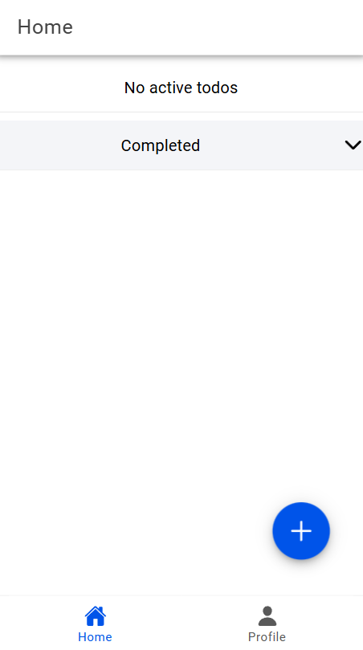

Pada halaman Home akan menampilkan daftar catatan yang telah dibuat (Active TODOS, catatan yang belum selesai dikerjakan). Karena belum terdapat catatan, maka aplikasi menampilkan "No Active todos". Di bawahnya terdapat todos yang sudah selesai (Completed TODOS, catatan yang sudah selesai). Karena belum menyelesaikan todos, maka aplikasi menampilkan "No completed todos" seperti gambar di bawah.

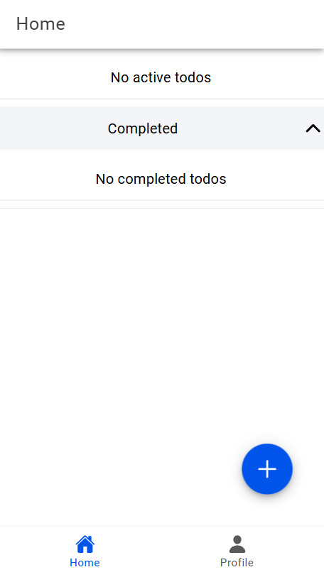

## Membuat Catatan (TODO)
Untuk menambahkan catatan, klik tombol + pada pojok kanan bawah. Aplikasi memanggil fungsi addTodo(). User akan diarahkan ke halaman Add Todo, seperti gambar di bawah ini.

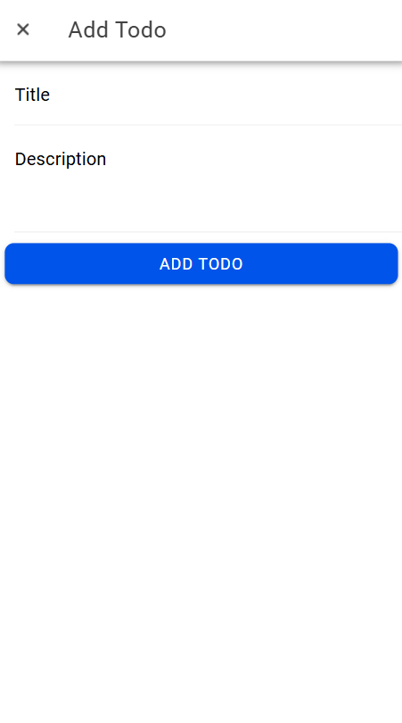

Pada form add todo, terdapat field yaitu title dan description yang harus diisi. Inputan tersebut dikirim melalui form menggunakan metode POST ke server.

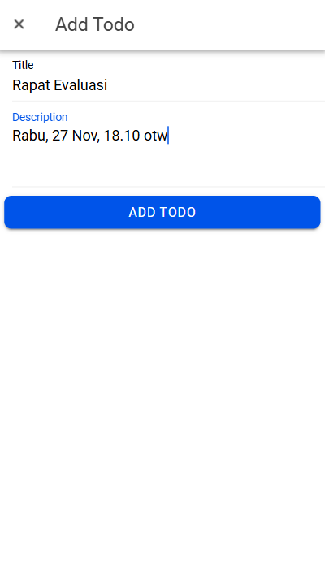

Ketika button "ADD TODO" diklik, maka data (title dan description) diambil dan disimpan ke database Firebase. User diarahkan kembali ke halaman home, dan menampilkan catatan yang berhasil ditambahkan di bagian Active TODOS, seperti gambar berikut.

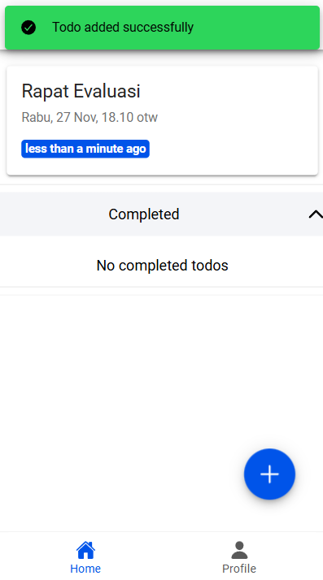

## Aksi
Terdapat aksi update dan delete, dengan menggeser card ke kiri, maka akan tampil aksi (edit dan delete) yang dapat dilakukan seperti gambar di bawah ini.

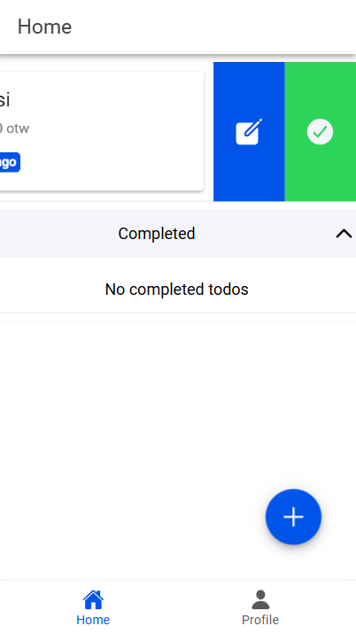

Jika button edit diklik,  fungsi handleEdit(todo) dipanggil. Fungsi ini menerima todo yang sedang diedit, dan mengisi data pada modal. Saat itu, user diarahkan ke halaman edit, seperti gambar di bawah ini. Lalu, form diisi dengan data yang akan diubah. Fungsi tersebut juga menyimpan ID dari todo yang sedang diedit.

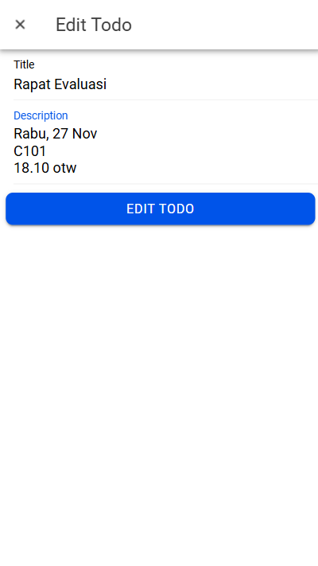

Jika button "EDIT TODO" diklik, maka data baru dikirim ke database Firebase. Timestamp diperbarui, lalu status berubah menjadi "less than minute ago" (menggunakan library timeago.js untuk mengatur format waktu dinamis). Jika berhasil mengubah data, maka user akan diarahkan ke halaman home. Lalu, alert 'berhasil' muncul seperti gambar di bawah ini.

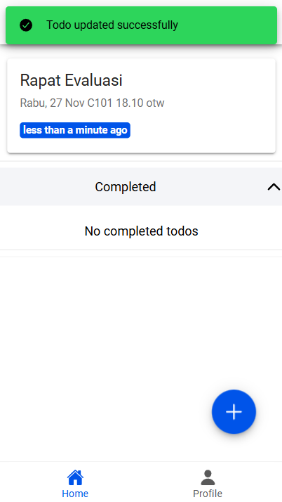

Jika ikon checklist diklik, maka artinya todo berhasil diselesaikan. Status catatan diubah menjadi selesai di database Firebase. Catatan tersebut akan dipindahkan ke bagian Completed.

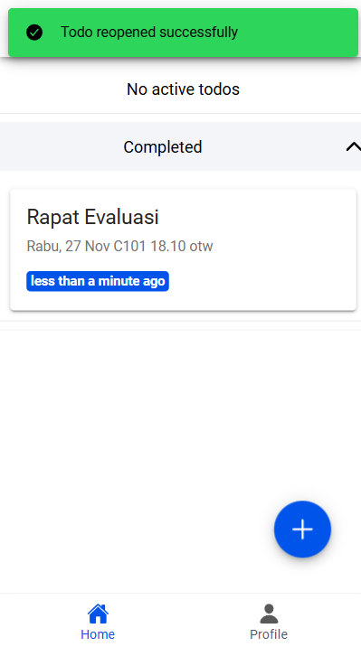

Terdapat aksi (edit dan batal) untuk catatan yang telah selesai.

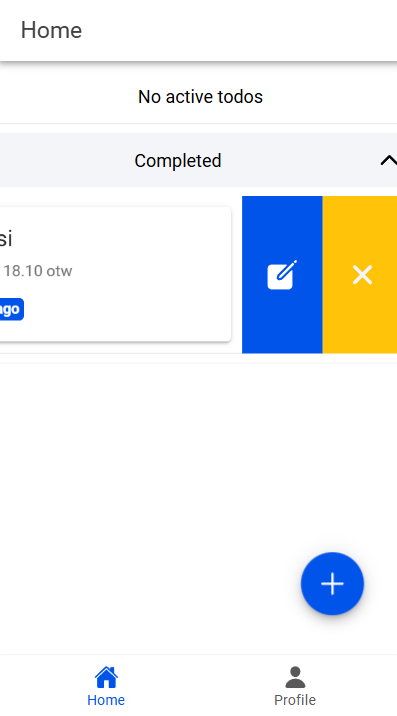

Jika ikon x (batal), maka catatan dipindahkan ke bagian atas (todo yang belum dikerjakan) dan alert berhasil muncul seperti gambar di bawah ini.

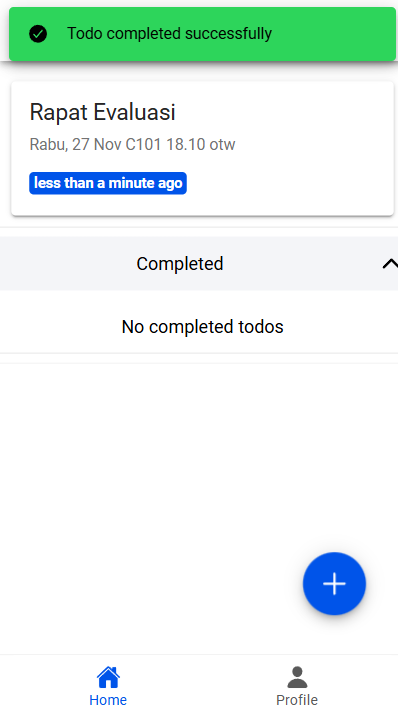

## Hapus 
Jika ingin menghapus todo yang telah dibuat, maka geser card ke kiri pada todo yang ingin dihapus, ikon delete akan muncul, seperti pada gambar di bawah ini.

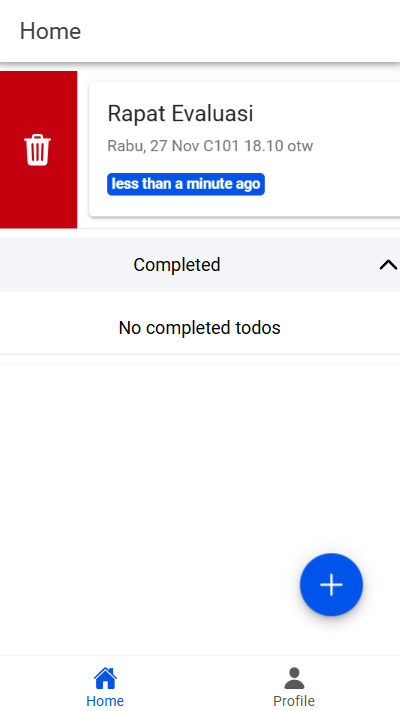

Fungsi handleDelete() akan dipanggil ketika pengguna memilih untuk menghapus todo. Fungsi ini akan mengirimkan permintaan penghapusan ke firestoreService.deleteTodo(), dengan parameter ID todo yang akan dihapus.
Jika ikon tersebut diklik, maka akan menghapus data todo tersebut dari database Firebase, dan menampilkan alert 'berhasil' seperti berikut.

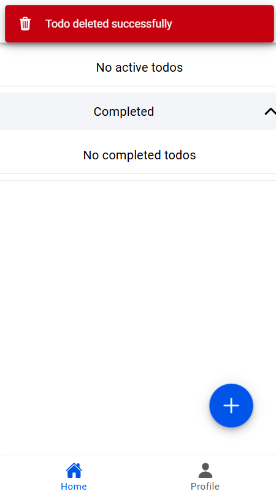

Terdapat tab menu di bagian bawah untuk navigasi ke halaman Home dan Profile

## Profile
Saat user mengklik ikon profil pada tab menu, user diarahkan ke halaman profile

nama pengguna diambil dari displayName.
email diambil dari email.
Data ini diakses dari Pinia Store mengunakan variabel user dan ditampilkan.
Pada halaman profil, juga terdapat tombol Logout. Ketika diklik, aplikasi memanggil fungsi logout di Pinia Store. 
Fungsi ini melakukan sign out dari firebase, menghapus data user dari variabel user, dan mengarahkan user kembali ke halaman pertama yaitu login.

# BUILD APK

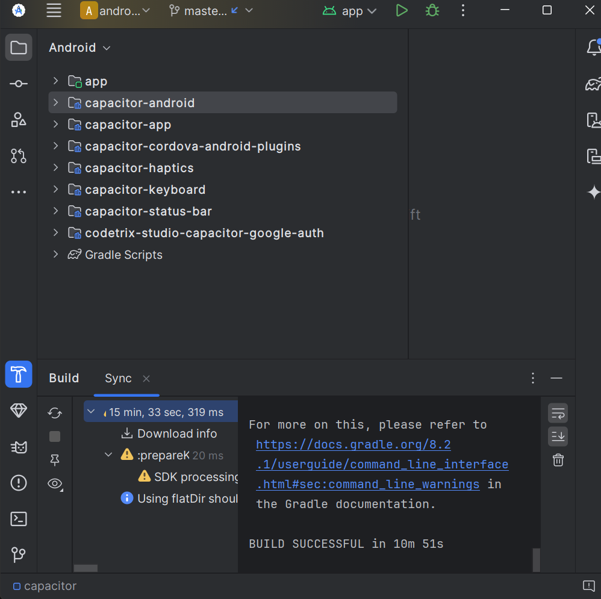

Pada halaman profil, juga terdapat tombol Logout. Ketika diklik, aplikasi memanggil fungsi logout di Pinia Store. 
Fungsi ini melakukan sign out dari firebase, menghapus data user dari variabel user, dan mengarahkan user kembali ke halaman pertama yaitu login.
