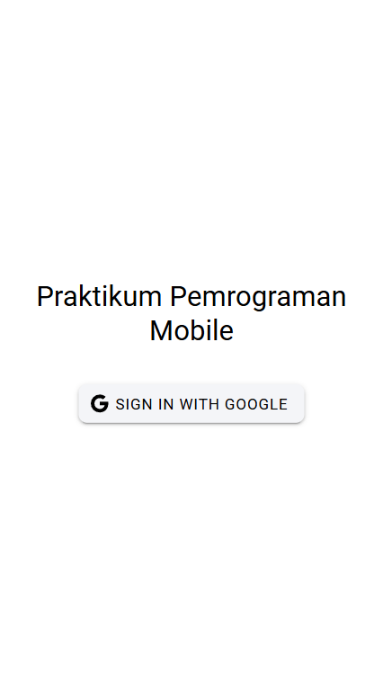
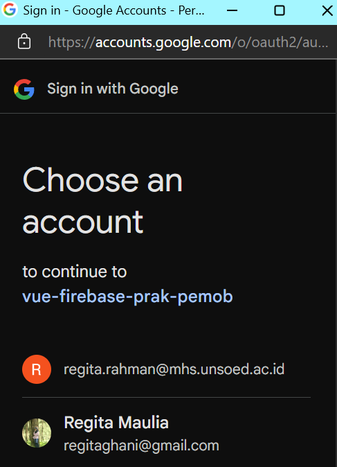
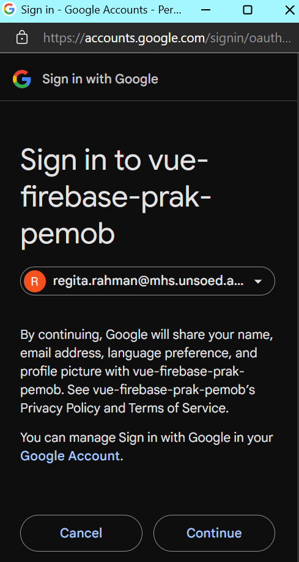
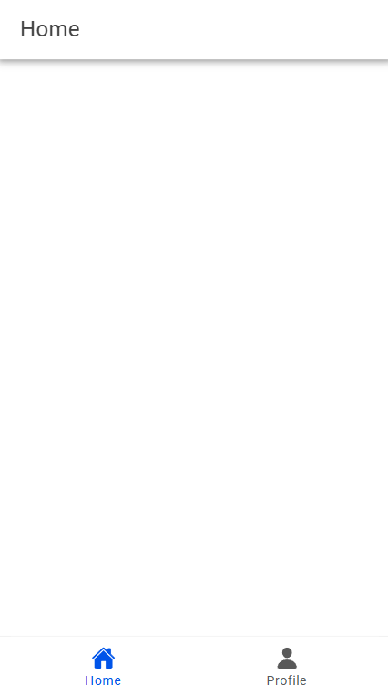
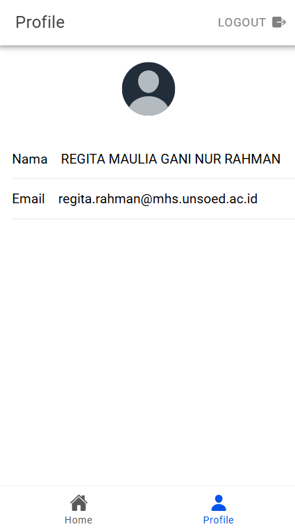

## Login
Halaman awal adalah sebagai berikut.

Terdapat tombol Sign In With Google. Saat tombol diklik, aplikasi memanggil fungsi loginWithGoogle yang didefinisikan di dalam Pinia Store
- Aplikasi mengkonfigurasi GoogleAuth dengan clientId dan izin (akses ke profil dan email pengguna)

- Pilih akun Google untuk login

- Setelah user berhasil login, aplikasi menerima id token dari google (autentikasi user)
- id token digunakan untuk membuat kredensial  Firebase untuk validasi, menggunakan GoogleAuthProvider. Jika berhasil, firebase memberikan informasi user seperti nama dan email, yang disimpan di variabel user di dalam Pinia Store.

## Berhasil Login
Jika berhasil login, user diarahkan ke halaman Home. 

Terdapat tab menu di bagian bawah untuk navigasi antara halaman Home dan Profile

## Profile
Saat user mengklik ikon profil pada tab menu, user diarahkan ke halaman profile

nama pengguna diambil dari displayName
email diambil dari email
Data ini diakses dari Pinia Store mengunakan variabel user dan ditampilkan.
Pada halaman profil, juga terdapat tombol Logout. Ketika diklik, aplikasi memanggil fungsi logout di Pinia Store. 
Fungsi ini melakukan sign out dari firebase, menghapus data user dari variabel user, dan mengarahkan user kembali ke halaman pertama yaitu login.